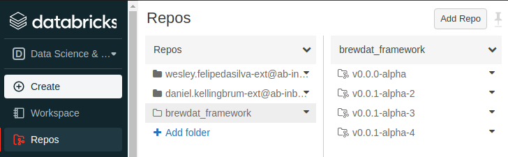
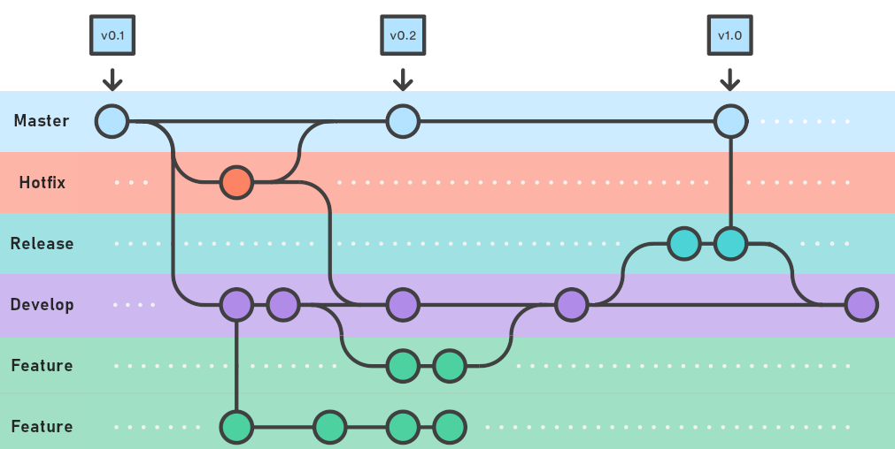

# BrewDat Library versioning and distribution

## Motivation

In ESA, we intend to provide data engineers with notebook templates and PySpark libraries that they can leverage to accelerate their development process -- extracting data to the Raw Layer, ingesting it into the Bronze Layer, ingesting it into the Silver Layer, and finally creating Gold data products based on that data, all while using best practices for auditing, exception handling, dependency control, Data Lake organization, etc.

One important aspect of these libraries and templates is that they will evolve over time, meaning newer versions will be released as new features become available (e.g., a new library function for running data quality checks, or a bugfix to an existing library function). These new versions will be made available for ESA users; however, BrewDat should not overwrite the user's copy without their consent, as that could cause existing data pipelines to fail. Instead, we plan to maintain the many library versions in GitHub, using releases with semantic versioning to allow multiple versions of the same library to coexist. This way, we will allow users to upgrade their code at their own pace, after proper testing.

## Assumptions

1. All releases must be properly versioned and documented such that anyone can see what changed in each release;
2. BrewDat/ESA platform team is responsible for releasing new versions of the library;
3. Data engineers are responsible for choosing a library version to work with, as well as upgrading/downgrading the library version used in any of their notebooks after proper testing;
4. Released library versions will be made available to the all Databricks workspaces in ESA through an automated deployment process;

## Data engineer experience using the library

Every Databricks Workspace in ESA will contain multiple vesions of the library as read-only repositories under Repos/brewdat_library/:



Each repository contains multiple library artifacts, including: Python modules and scripts, sample notebooks, markdown documents such as this one, etc. Only Workspace Admins can change these repositories.

To start using the library code in a custom notebook, append the path for the library version to sys.path: 

```python
import sys

sys.path.append("/Workspace/Repos/brewdat_framework/v0.1.0")
```

Different notebooks can reference different library versions, even if they are running on the same cluster. 

To use some functionality from the library, you must use Python's `import` statement informing which class/function you require:

```python
# Import the BrewDat Library class
sys.path.append(f"/Workspace/Repos/brewdat_framework/v0.1.0")
from brewdat.data_engineering.utils import BrewDatLibrary

# Initialize the BrewDat Library
brewdat_library = BrewDatLibrary(spark=spark, dbutils=dbutils)
```

To upgrade the library on existing notebooks, data engineers need to change the appended path to point to the new library version. It is good practice to run integration tests before promoting the new code to production.

## Library versioning and release

Library artifacts are versioned in a git repository. All ABI data engineers and architects should be able to view it: [https://github.com/BrewDat/brewdat-pltfrm-ghq-tech-template-adb](https://github.com/BrewDat/brewdat-pltfrm-ghq-tech-template-adb)

The workflow for evolving library artifacts follows the Gitflow workflow, as discribed [here](https://www.atlassian.com/git/tutorials/comparing-workflows/gitflow-workflow).



For every commit to the main branch, a new [GitHub Release](https://docs.github.com/en/repositories/releasing-projects-on-github/managing-releases-in-a-repository) and tag are created. The release page provides an overview of changes introduced in each release. Through release page, it is easy to compare library versions and have a more in-depth understanding of their differences.


Release and tags names always reference a library version. Version numbers follow the semantic versioning standard (see: [https://semver.org/spec/v2.0.0.html](https://semver.org/spec/v2.0.0.html)).

### CI/CD pipeline

#### Unit tests

Unit tests will be run automatically for every new Pull Request. Merging new code into develop and main branches is only allowed if all unit tests ran successfully. We will strive to create a large number of unit tests to allow for stable library releases.

#### Delivery

Every new tag created for a new release will trigger the continuous delivery process. The steps for the delivery pipeline are:

- For every Databricks Workspace in ESA:
    - For every existing library release tag in GitHub:
        - Check if the Databricks Workspace contains a Repo referencing that release tag in the /brewdat_library/ folder
        - If not, create the Repo in that folder

Assumptions:
- The pipeline agent must have permissions to list Databricks Workspaces from all ESA subscriptions;
- The pipeline agent must have permissions to interact with every Databricks Workspace through the Repos API and Workspace API;
- Since the delivery process is triggered by the tag creation event, when a new Databricks Workspace is created, the delivery pipeline must be triggered manually to deliver all library versions to that workspace.

### Collaborative library evolution

Every data engineer in ABI is welcome to support the evolution of this library. Valuable collaboration efforts includes:
- Helping validate unreleased versions of the library;
- Submitting issues regarding unexpected behavior or bugs;
- Actively submitting pull requests from other forks.

To test an unreleased library version, the data engineer may create a Repo under their personal Repos folder and select a specific branch where some feature/bugfix is being developed. Then they can append this new path to sys.path instead.

### Outcomes

- GitHub version control and release management
- Allow multiple versions of the library to coexist in the same cluster
- CI/CD pipelines
- New library versions always available for ADB workspaces in ESA
- Users can take part in library development
- Unit tests as part of the library development lifecycle
