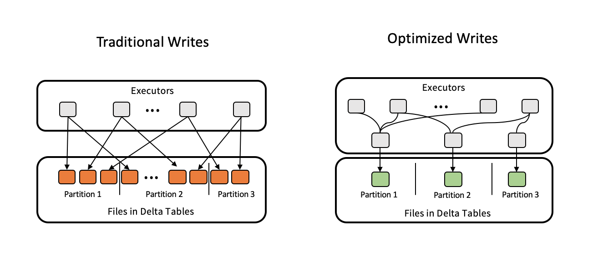

# Optimizations on CSA Lakehouse

Delta Lake offers some optimization features that might improve performance and costs throughout the platform.

This document showcases some of those features as well as how they fit into CSA lakehouse strategy.


## DATA SKIPPING

Data Skipping is a performance optimization that aims at speeding up queries that contain filters (WHERE clauses). As new data is inserted into a Delta table, file-level min/max statistics are collected for all columns (including nested ones) of supported types. Then, when there’s a lookup query against the table, Delta first consults these statistics to determine which files can safely be skipped.

**This is done automatically** and no specific commands are required.


## PARTITION BY

Spark is designed to process large datasets 100x faster than traditional processing, this wouldn’t have been possible without partitions. Below are some of the advantages of using partitions.

* Fast access to the data.
* Provides the ability to perform an operation on a smaller dataset.

Partitioning at rest (disk) is a feature of many databases and data processing frameworks and it is key to make reads faster.

All writing functions from [brewdat library](https://github.com/BrewDat/brewdat-pltfrm-ghq-tech-template-adb/releases) provide a parameter for setting a proper partition column for data being written.

*Choosing the right partition column*

You can partition a Delta table by a column. The most commonly used partition column is some date column. Follow these two rules of thumb for deciding on what column to partition by:

* If the cardinality of a column will be very high, do not use that column for partitioning. For example, if you partition by a column userId and if there can be 1M distinct user IDs, then that is a bad partitioning strategy.
* Amount of data in each partition: You can partition by a column if you expect data in that partition to be at least 1 GB.
* Partitioning is not required for smaller tables.


## AUTO OPTIMIZE (OPTIMIZED WRITES and AUTO COMPACTION)

Auto Optimize is an optional set of features that automatically compact small files during individual writes to a Delta table. Paying a small cost during writes offers significant benefits for tables that are queried actively. Auto Optimize is particularly useful in the following scenarios:

* Streaming use cases where latency in the order of minutes is acceptable
* MERGE INTO is the preferred method of writing into Delta Lake
* CREATE TABLE AS SELECT or INSERT INTO are commonly used operations

Auto Optimize consists of two complementary features: Optimized Writes and Auto Compaction.

*Optimized Writes*

Databricks dynamically optimizes Apache Spark partition sizes based on the actual data, and attempts to write out 128 MB files for each table partition. This is an approximate size and can vary depending on dataset characteristics.




*Auto Compaction*

After an individual write, Databricks checks if files can further be compacted, and runs an OPTIMIZE job (with 128 MB file sizes instead of the 1 GB file size used in the standard OPTIMIZE) to further compact files for partitions that have the most number of small files.


All writing functions from [brewdat library](https://github.com/BrewDat/brewdat-pltfrm-ghq-tech-template-adb/releases) have **auto optimize already turned on**.

For more information on auto optimize, click [here](https://docs.microsoft.com/en-us/azure/databricks/delta/optimizations/auto-optimize).


## OPTIMIZE and ZORDER BY

Historical and new data is often written in very small files and directories.  This data may be spread across a data center or even across the world (that is, not co-located).  The result is that a query on this data may be very slow due to network latency
volume of file metadata. The solution is to compact many small files into one larger file.

OPTIMIZE command invokes the bin-packing (compaction) algorithm to coalesce small files into larger ones. Small files are compacted together into new larger files up to 1GB (by default).

```sql
OPTIMIZE events
```

*ZORDER BY*

Colocates column information in the same set of files. 

If you expect a column to be commonly used in query predicates and if that column has high cardinality (that is, a large number of distinct values), then you can use ZORDER BY. This is option is meant to colocate column information in the same set of files. Co-locality is used by Delta Lake data-skipping algorithms to dramatically reduce the amount of data that needs to be read. You can specify multiple columns for ZORDER BY as a comma-separated list. However, the effectiveness of the locality drops with each additional column.

```sql
OPTIMIZE events
ZORDER BY (eventType)
```

*When should OPTIMIZE commands be executed for a table?*

For tables with size greater than 10 TB, we recommend that you keep OPTIMIZE running on a schedule to further consolidate files, and reduce the metadata of your Delta table. Since Auto Optimize does not support Z-Ordering, you should still schedule OPTIMIZE ... ZORDER BY jobs to run periodically.

For more information about OPTIMIZE command, click [here](https://docs.microsoft.com/en-us/azure/databricks/spark/latest/spark-sql/language-manual/delta-optimize).


## CSA LAKEHOUSE

### raw

Once this data layer is usually not on Delta Lake format, optmizations mentioned before don't apply except partitioning.
Extract data to this layer partitioning by date (current date).
The process that reads raw data and writes it to bronze layer can then filter based on this date (e.g: current_date - 1) and make use of this partition to skip older files.
All [ADF pipeline templates for extraction](https://github.com/BrewDat/brewdat-pltfrm-ghq-tech-template-adf/releases) provided by CSA platform team already implement this partitioning strategy. On these templates, the partition column name is `__ref_dt` and adopted date format is `yyyyMMdd`.

### bronze

Since bronze layer is usually an append only layer and it is meant for tracking historical data, data should be partitioned by ingestion/extraction date. If data was extracted through some CSA ADF template, the same `__ref_df` date could be used for partitioning.
With this partition strategy, the process that reads data from bronze and incrementally writes it to silver layer can then filter the date partition and skip older files/partitions.

*When command OPTIMIZE should be executed?*

Since AUTO OPTIMIZE is turned on, in most cases this is not necessary. 
Regarding performance on jobs that loads data from bronze to silver layer, there is not much of a improvement since only new data is processed. 
For tables bigger than 10 TB of data, running OPTIMIZE can help to reduce the storage costs. However, it is not recomended to execute OPTMIZE on every write to the table or in a excessive way once this could be a performance hit and the cost on computing might not cover the storage cost. In this case, a job could be created specically for optimization. This new job should be scheduled in a way that matches the growth pace of the table.
Bronze layer is not a consumption layer, so ZORDER BY doesn't make much sense here. 


### silver and gold

Silver and gold are consumption ready layers, so the optimization strategy for tables on these layers should take in consideration the data profile and the scenarios where this table is being used. The following decision tree can help identifying the proper partition column.


A good partition column has the following characteristics:
* It is commonly used as filter on queries executed against the table;
* Low cardinality;
* Data is well distributed (balanced).

Regarding cardinality, if a high cardinality column is selected as partition column, the table might end up having excessive number of partitions and lots of small files (which Spark engine doesn't handle very well) and the overall performance of reading data from table could actually be worst than having no partition at all.

Data distribution is another important aspect. If most of data is bucketed inside the same (or just a few) partition(s), then there is no real benefit on having partitions set.

*Multiple columns as partitions*


Although in most cases having only a single column as partition is recommended, it is indeed possible to have multiple columns as partitions.


The recomendations regarding table size, partition size and column cardinality from single partition approach still apply is this case and should be taken in consideration even more carefully. Remember that excessive number of partitions and small files should always be avoided, so go with multiple partitions only for tables particularly large. It is also recommended to set the lowest cardinality column as first (root) partition.


E.g.:
- Table X holds orders data from all ABI zones.
- The expected amount of data is huge. 
- Every query should filter by zone and a period of time (creation date).
- Zone and creation date are well distributed columns.
- Then, zone and creation date could be used as partitions(respecting this order once zone cardinality is lower than creation date).


*OPTIMIZE and ZORDER*

Since AUTO OPTIMIZE is turned on, in most cases this is not necessary.

For tables bigger than 10 TB of data, running OPTMIZE can help to reduce the storage costs. However, it is not recomended to execute OPTMIZE on every write to the table or in a excessive way once this could be a performance hit and the cost on computing might not cover the storage cost. In this case, a job could be created specically for optimization. This new job should be scheduled in a way that matches the growth pace of the table.

If you expect a column to be commonly used in query predicates and if that column has high cardinality (that is, a large number of distinct values), then you can use ZORDER BY. You can also specify multiple columns for ZORDER BY. However, the effectiveness of the locality drops with each additional column.

E.g.: 
- Table X holds customer data.
- This table is commonly joined to others through the customer_id column.
- Then, table X can be optimized with ZORDER BY customer_id.
